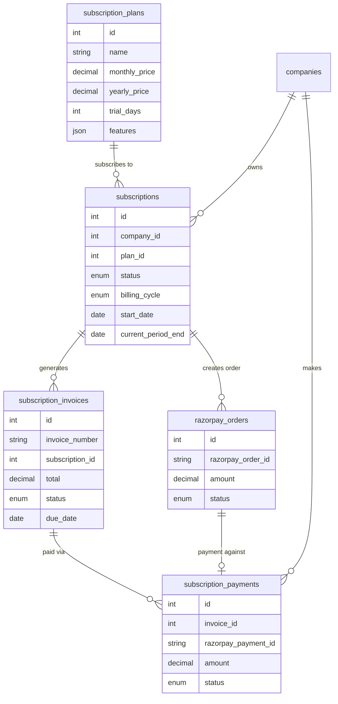
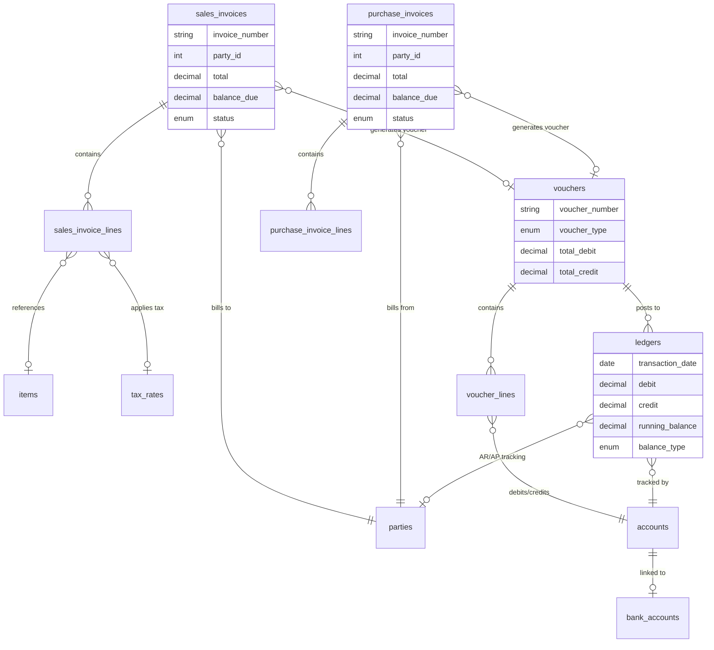

# Reco Accounting SaaS — Complete ERD & Migration Plan

> **Generated:** 2026-06-05  
> **Status:** Architecture Review & Planning  
> **Version:** 2.0 (Updated Requirements)

---

## Table of Contents

1. [Executive Summary](#1-executive-summary)
2. [Current State Analysis](#2-current-state-analysis)
3. [Complete Entity Relationship Diagram](#3-complete-entity-relationship-diagram)
4. [Existing Tables (Already Migrated)](#4-existing-tables)
5. [New Tables Required](#5-new-tables-required)
6. [Tables Requiring Schema Alterations](#6-tables-requiring-alterations)
7. [Migration Execution Plan](#7-migration-execution-plan)
8. [Database Standards Checklist](#8-database-standards-checklist)

---

## 1. Executive Summary

The Reco accounting platform currently has **12 core tables** covering authentication, RBAC, accounting masters, vouchers, ledger entries, and audit logging. The updated requirements introduce **~25 new tables** spanning subscriptions, payments, website CMS, theme management, offline sync, login history, and expanded accounting features (items, taxes, bank accounts, invoices).

**Key Gaps Identified:**

| Domain | Current State | Gap |
|--------|--------------|-----|
| Subscriptions | ❌ None | Plans, subscriptions, invoices, payments |
| Razorpay Integration | ❌ None | Payment orders, webhooks, refunds |
| Website / CMS | ❌ None | Pages, FAQs, testimonials, pricing |
| Theme Management | ❌ None | Dedicated theme table (currently settings-based) |
| Login History | ❌ None | Device tracking, session management |
| Items / Taxes | ❌ None | Product catalog, tax rates, HSN/SAC |
| Sales/Purchase Invoices | ❌ None | Proper invoice headers + line items |
| Bank Accounts | ❌ None | Bank reconciliation support |
| Offline Sync | ❌ None | UUID, version, sync timestamps on all tables |
| OTP Verification | ❌ None | OTP storage for signup flow |

---

## 2. Current State Analysis

### Existing Tables (12 Core + 4 Laravel System)

```
EXISTING CORE TABLES:
├── companies           (SaaS multi-tenant root)
├── users               (Auth, company_id, roles, PIN, security)
├── roles               (RBAC - company scoped)
├── permissions         (RBAC - global)
├── permission_role     (Pivot)
├── role_user           (Pivot)
├── settings            (Key-value, company scoped)
├── financial_years     (Fiscal period management)
├── accounts            (Chart of accounts - 5 types)
├── parties             (Debtors & Creditors)
├── vouchers            (6 types: income/expense/receipt/payment/journal/adjustment)
├── voucher_lines       (Double-entry lines)
├── ledgers             (Running balance engine)
└── audit_logs          (Activity tracking)

LARAVEL SYSTEM TABLES:
├── users
├── password_reset_tokens
├── sessions
├── personal_access_tokens
├── cache / cache_locks
└── jobs
```

### Current Audit Fields Pattern

Every business table follows this pattern:
```php
$table->unsignedBigInteger('created_by')->nullable();
$table->unsignedBigInteger('updated_by')->nullable();
$table->string('created_by_ip')->nullable();
$table->string('updated_by_ip')->nullable();
$table->string('deleted_by')->nullable();
$table->unsignedBigInteger('deleted_by_id')->nullable();
$table->timestamps();
$table->softDeletes();
```

**⚠️ Missing from current pattern:** `uuid`, `version` (required for offline sync)

---

## 3. Complete Entity Relationship Diagram

### 3.1 High-Level Domain Map

```mermaid
graph TB
    subgraph "AUTH & TENANCY"
        COMPANY[companies]
        USER[users]
        ROLE[roles]
        PERM[permissions]
        COMPANY --> USER
        COMPANY --> ROLE
        ROLE --> PERM
        USER --> ROLE
    end

    subgraph "SUBSCRIPTION & BILLING"
        PLAN[subscription_plans]
        SUB[subscriptions]
        SUB_PAY[subscription_payments]
        SUB_INV[subscription_invoices]
        PLAN --> SUB
        SUB --> SUB_PAY
        SUB --> SUB_INV
        COMPANY --> SUB
    end

    subgraph "PAYMENT GATEWAY"
        RAZ_ORDER[razorpay_orders]
        RAZ_WEBHOOK[razorpay_webhooks]
        RAZ_ORDER --> SUB_PAY
    end

    subgraph "ACCOUNTING MASTERS"
        FY[financial_years]
        ACCT[accounts]
        PARTY[parties]
        ITEM[items]
        TAX[tax_rates]
        BANK[bank_accounts]
        COMPANY --> FY
        COMPANY --> ACCT
        COMPANY --> PARTY
        COMPANY --> ITEM
        COMPANY --> TAX
        COMPANY --> BANK
    end

    subgraph "TRANSACTIONS"
        VOUCHER[vouchers]
        V_LINE[voucher_lines]
        S_INV[sales_invoices]
        S_LINE[sales_invoice_lines]
        P_INV[purchase_invoices]
        P_LINE[purchase_invoice_lines]
        VOUCHER --> V_LINE
        S_INV --> S_LINE
        P_INV --> P_LINE
    end

    subgraph "LEDGER ENGINE"
        LEDGER[ledgers]
        ACCT --> LEDGER
        VOUCHER --> LEDGER
    end

    subgraph "WEBSITE & CMS"
        PAGE[website_pages]
        FAQ[faqs]
        TESTIMONIAL[testimonials]
        PRICING[pricing_display]
        CONTACT[contact_submissions]
    end

    subgraph "SECURITY & AUDIT"
        AUDIT[audit_logs]
        LOGIN_HIST[login_history]
        OTP[otp_verifications]
        DEVICE[user_devices]
    end

    subgraph "THEME"
        THEME[themes]
        COMPANY --> THEME
    end
```

### 3.2 Detailed ERD — All Tables & Relationships

```mermaid
erDiagram
    %% ==========================================
    %% AUTHENTICATION & TENANCY
    %% ==========================================

    companies {
        bigint id PK
        uuid uuid UK
        string name
        string email
        string phone
        text address
        string city
        string state
        string country
        string postal_code
        string gst_number
        string pan_number
        string logo
        string favicon
        string currency "default INR"
        string timezone "default Asia/Kolkata"
        string financial_year_start "default 04-01"
        string financial_year_end "default 03-31"
        boolean is_active
        string slug UK
        string website
        string domain
        int version "offline sync"
        datetime synced_at "offline sync"
        bigint created_by FK
        bigint updated_by FK
        string created_by_ip
        string updated_by_ip
        string deleted_by
        bigint deleted_by_id FK
        timestamps
        soft_deletes
    }

    users {
        bigint id PK
        uuid uuid UK
        bigint company_id FK
        string name
        string email UK
        string phone
        string avatar
        string password
        string pin
        boolean has_pin
        boolean app_lock_enabled
        boolean biometric_enabled
        int auto_lock_timeout
        enum role "admin|manager|accountant|viewer"
        enum status "active|inactive|suspended"
        timestamp email_verified_at
        timestamp last_login_at
        string last_login_ip
        string remember_token
        int version
        datetime synced_at
        bigint created_by FK
        bigint updated_by FK
        string created_by_ip
        string updated_by_ip
        string deleted_by
        bigint deleted_by_id FK
        timestamps
        soft_deletes
    }

    roles {
        bigint id PK
        uuid uuid UK
        bigint company_id FK
        string name
        string slug UK
        text description
        boolean is_default
        boolean is_active
        int version
        datetime synced_at
        bigint created_by FK
        bigint updated_by FK
        string created_by_ip
        string updated_by_ip
        string deleted_by
        bigint deleted_by_id FK
        timestamps
        soft_deletes
    }

    permissions {
        bigint id PK
        string name
        string slug UK
        string module
        text description
        boolean is_active
        bigint created_by FK
        bigint updated_by FK
        string created_by_ip
        string updated_by_ip
        string deleted_by
        bigint deleted_by_id FK
        timestamps
        soft_deletes
    }

    permission_role {
        bigint id PK
        bigint permission_id FK
        bigint role_id FK
        timestamps
    }

    role_user {
        bigint id PK
        bigint role_id FK
        bigint user_id FK
        timestamps
    }

    %% ==========================================
    %% SUBSCRIPTION & BILLING (NEW)
    %% ==========================================

    subscription_plans {
        bigint id PK
        uuid uuid UK
        string name "e.g. Trial, Basic, Pro"
        string slug UK
        text description
        decimal monthly_price
        decimal yearly_price
        string currency "default INR"
        int trial_days "0 = no trial"
        int max_users
        int max_transactions
        int max_accounts
        int max_parties
        json features "JSON array of feature flags"
        int sort_order
        boolean is_active
        boolean is_default
        boolean is_visible "show on pricing page"
        int version
        datetime synced_at
        bigint created_by FK
        bigint updated_by FK
        string created_by_ip
        string updated_by_ip
        timestamps
    }

    subscriptions {
        bigint id PK
        uuid uuid UK
        bigint company_id FK
        bigint plan_id FK
        enum status "trial|active|past_due|cancelled|expired|paused"
        enum billing_cycle "monthly|yearly"
        date start_date
        date trial_end_date
        date current_period_start
        date current_period_end
        date cancelled_at
        date pause_until
        decimal amount
        string currency
        string razorpay_subscription_id
        json metadata
        int version
        datetime synced_at
        bigint created_by FK
        bigint updated_by FK
        string created_by_ip
        string updated_by_ip
        timestamps
        soft_deletes
    }

    subscription_invoices {
        bigint id PK
        uuid uuid UK
        string invoice_number UK
        bigint company_id FK
        bigint subscription_id FK
        decimal subtotal
        decimal tax_amount
        decimal discount_amount
        decimal total
        string currency
        enum status "draft|sent|paid|overdue|cancelled|refunded"
        date invoice_date
        date due_date
        date paid_at
        json line_items
        string notes
        int version
        datetime synced_at
        bigint created_by FK
        bigint updated_by FK
        string created_by_ip
        string updated_by_ip
        timestamps
        soft_deletes
    }

    subscription_payments {
        bigint id PK
        uuid uuid UK
        bigint company_id FK
        bigint subscription_id FK
        bigint invoice_id FK
        string razorpay_payment_id
        string razorpay_order_id
        decimal amount
        string currency
        enum status "pending|processing|completed|failed|refunded"
        string payment_method
        json gateway_response
        date paid_at
        string failure_reason
        int version
        datetime synced_at
        string created_by_ip
        string updated_by_ip
        timestamps
    }

    %% ==========================================
    %% RAZORPAY INTEGRATION (NEW)
    %% ==========================================

    razorpay_orders {
        bigint id PK
        uuid uuid UK
        bigint company_id FK
        bigint subscription_id FK
        string razorpay_order_id UK
        decimal amount
        string currency
        enum status "created|attempted|paid|failed"
        int attempts
        json notes
        json gateway_response
        string receipt
        datetime created_by_ip
        timestamps
    }

    razorpay_webhooks {
        bigint id PK
        string event_type
        string razorpay_event_id UK
        json payload
        enum status "received|processed|failed|ignored"
        text error_message
        int retry_count
        timestamp processed_at
        timestamps
    }

    %% ==========================================
    %% ACCOUNTING MASTERS
    %% ==========================================

    financial_years {
        bigint id PK
        uuid uuid UK
        bigint company_id FK
        string name
        date start_date
        date end_date
        boolean is_current
        boolean is_closed
        date closed_at
        int version
        datetime synced_at
        bigint created_by FK
        bigint updated_by FK
        string created_by_ip
        string updated_by_ip
        string deleted_by
        bigint deleted_by_id FK
        timestamps
        soft_deletes
    }

    accounts {
        bigint id PK
        uuid uuid UK
        bigint company_id FK
        bigint financial_year_id FK
        string account_code UK
        string account_name
        enum account_type "asset|liability|income|expense|equity"
        bigint parent_id FK
        decimal opening_balance
        date opening_date
        text remarks
        boolean is_active
        boolean is_system
        boolean is_bank_account "flag for bank linkage"
        int sort_order
        int version
        datetime synced_at
        bigint created_by FK
        bigint updated_by FK
        string created_by_ip
        string updated_by_ip
        string deleted_by
        bigint deleted_by_id FK
        timestamps
        soft_deletes
    }

    parties {
        bigint id PK
        uuid uuid UK
        bigint company_id FK
        bigint financial_year_id FK
        string party_code UK
        string name
        enum type "debtor|creditor"
        string mobile
        string email
        text address
        string city
        string state
        string country
        string postal_code
        string gst_number
        string pan_number
        decimal opening_balance
        date opening_date
        text remarks
        boolean is_active
        int credit_limit
        int payment_terms_days
        int version
        datetime synced_at
        bigint created_by FK
        bigint updated_by FK
        string created_by_ip
        string updated_by_ip
        string deleted_by
        bigint deleted_by_id FK
        timestamps
        soft_deletes
    }

    items {
        bigint id PK
        uuid uuid UK
        bigint company_id FK
        string item_code UK
        string name
        string hsn_sac_code
        enum type "goods|service"
        bigint tax_rate_id FK
        bigint income_account_id FK
        bigint expense_account_id FK
        decimal purchase_price
        decimal selling_price
        string unit "nos, kg, ltr, mtr, etc."
        text description
        string barcode
        decimal opening_stock
        decimal current_stock
        decimal reorder_level
        boolean is_active
        boolean is_stockable
        int version
        datetime synced_at
        bigint created_by FK
        bigint updated_by FK
        string created_by_ip
        string updated_by_ip
        string deleted_by
        bigint deleted_by_id FK
        timestamps
        soft_deletes
    }

    tax_rates {
        bigint id PK
        uuid uuid UK
        bigint company_id FK
        string name "e.g. GST 18%, GST 5%"
        string code "e.g. GST18"
        decimal rate "percentage"
        enum type "gst|igst|cgst_sgst|vat|exempt"
        decimal cgst_rate
        decimal sgst_rate
        decimal igst_rate
        boolean is_inclusive
        boolean is_active
        int version
        datetime synced_at
        bigint created_by FK
        bigint updated_by FK
        string created_by_ip
        string updated_by_ip
        timestamps
    }

    bank_accounts {
        bigint id PK
        uuid uuid UK
        bigint company_id FK
        bigint account_id FK "links to accounts table"
        string bank_name
        string branch_name
        string account_number
        string ifsc_code
        string account_holder_name
        enum account_type "savings|current|fixed_deposit|cc_od"
        decimal opening_balance
        date opening_date
        string upi_id
        boolean is_default
        boolean is_active
        text remarks
        int version
        datetime synced_at
        bigint created_by FK
        bigint updated_by FK
        string created_by_ip
        string updated_by_ip
        string deleted_by
        bigint deleted_by_id FK
        timestamps
        soft_deletes
    }

    %% ==========================================
    %% TRANSACTIONS
    %% ==========================================

    vouchers {
        bigint id PK
        uuid uuid UK
        bigint company_id FK
        bigint financial_year_id FK
        bigint party_id FK
        string voucher_number UK
        enum voucher_type "income|expense|receipt|payment|journal|adjustment"
        date voucher_date
        text narration
        decimal total_debit
        decimal total_credit
        enum status "draft|posted|cancelled"
        text remarks
        bigint sales_invoice_id FK "nullable"
        bigint purchase_invoice_id FK "nullable"
        int version
        datetime synced_at
        bigint created_by FK
        bigint updated_by FK
        string created_by_ip
        string updated_by_ip
        string deleted_by
        bigint deleted_by_id FK
        timestamps
        soft_deletes
    }

    voucher_lines {
        bigint id PK
        uuid uuid UK
        bigint voucher_id FK
        bigint account_id FK
        decimal debit
        decimal credit
        text description
        int sort_order
        int version
        datetime synced_at
        bigint created_by FK
        bigint updated_by FK
        timestamps
    }

    sales_invoices {
        bigint id PK
        uuid uuid UK
        bigint company_id FK
        bigint financial_year_id FK
        bigint party_id FK "debtor"
        string invoice_number UK
        date invoice_date
        date due_date
        string reference_number
        text notes
        decimal subtotal
        decimal discount_amount
        decimal discount_percentage
        decimal tax_amount
        decimal total
        decimal amount_paid
        decimal balance_due
        string currency "default INR"
        enum status "draft|sent|partial|paid|overdue|cancelled|credit_note"
        boolean is_recurring
        int version
        datetime synced_at
        bigint created_by FK
        bigint updated_by FK
        string created_by_ip
        string updated_by_ip
        string deleted_by
        bigint deleted_by_id FK
        timestamps
        soft_deletes
    }

    sales_invoice_lines {
        bigint id PK
        uuid uuid UK
        bigint sales_invoice_id FK
        bigint item_id FK "nullable"
        bigint account_id FK
        bigint tax_rate_id FK "nullable"
        string description
        decimal quantity
        decimal unit_price
        decimal discount_percentage
        decimal discount_amount
        decimal tax_amount
        decimal total
        int sort_order
        int version
        datetime synced_at
        timestamps
    }

    purchase_invoices {
        bigint id PK
        uuid uuid UK
        bigint company_id FK
        bigint financial_year_id FK
        bigint party_id FK "creditor"
        string invoice_number UK
        string supplier_invoice_number
        date invoice_date
        date due_date
        text notes
        decimal subtotal
        decimal discount_amount
        decimal discount_percentage
        decimal tax_amount
        decimal total
        decimal amount_paid
        decimal balance_due
        string currency
        enum status "draft|verified|partial|paid|overdue|cancelled|debit_note"
        int version
        datetime synced_at
        bigint created_by FK
        bigint updated_by FK
        string created_by_ip
        string updated_by_ip
        string deleted_by
        bigint deleted_by_id FK
        timestamps
        soft_deletes
    }

    purchase_invoice_lines {
        bigint id PK
        uuid uuid UK
        bigint purchase_invoice_id FK
        bigint item_id FK "nullable"
        bigint account_id FK
        bigint tax_rate_id FK "nullable"
        string description
        decimal quantity
        decimal unit_price
        decimal discount_percentage
        decimal discount_amount
        decimal tax_amount
        decimal total
        int sort_order
        int version
        datetime synced_at
        timestamps
    }

    %% ==========================================
    %% LEDGER ENGINE
    %% ==========================================

    ledgers {
        bigint id PK
        bigint company_id FK
        bigint financial_year_id FK
        bigint account_id FK
        bigint party_id FK "nullable - for AR/AP tracking"
        bigint voucher_id FK "nullable"
        date transaction_date
        string reference_type "voucher|opening|adjustment|sales_invoice|purchase_invoice|receipt|payment"
        bigint reference_id
        text description
        decimal debit
        decimal credit
        decimal running_balance
        enum balance_type "debit|credit"
        int version
        datetime synced_at
        bigint created_by FK
        bigint updated_by FK
        string created_by_ip
        string updated_by_ip
        timestamps
    }

    %% ==========================================
    %% WEBSITE & CMS (NEW)
    %% ==========================================

    website_pages {
        bigint id PK
        string slug UK
        string title
        string meta_title
        text meta_description
        longtext content
        string template "default|landing|pricing|faq"
        enum status "draft|published|archived"
        boolean show_in_nav
        int nav_order
        int version
        datetime synced_at
        bigint created_by FK
        bigint updated_by FK
        string created_by_ip
        string updated_by_ip
        timestamps
        soft_deletes
    }

    faqs {
        bigint id PK
        uuid uuid UK
        string question
        text answer
        string category
        int sort_order
        boolean is_active
        int version
        datetime synced_at
        bigint created_by FK
        bigint updated_by FK
        string created_by_ip
        string updated_by_ip
        timestamps
    }

    testimonials {
        bigint id PK
        uuid uuid UK
        string client_name
        string company_name
        string designation
        text testimonial
        string avatar
        int rating "1-5"
        boolean is_featured
        boolean is_active
        int sort_order
        int version
        datetime synced_at
        bigint created_by FK
        bigint updated_by FK
        string created_by_ip
        string updated_by_ip
        timestamps
    }

    contact_submissions {
        bigint id PK
        uuid uuid UK
        string name
        string email
        string phone
        string subject
        text message
        enum status "new|read|replied|archived"
        text admin_notes
        timestamp read_at
        timestamp replied_at
        string replied_by
        bigint replied_by_id FK
        string created_by_ip
        timestamps
    }

    pricing_display {
        bigint id PK
        bigint plan_id FK
        string badge "e.g. Most Popular"
        string highlight_color
        text description_short
        text description_long
        json features_list
        int sort_order
        boolean is_active
        int version
        datetime synced_at
        bigint created_by FK
        bigint updated_by FK
        string created_by_ip
        string updated_by_ip
        timestamps
    }

    %% ==========================================
    %% THEME MANAGEMENT (NEW)
    %% ==========================================

    themes {
        bigint id PK
        uuid uuid UK
        bigint company_id FK "nullable - null = website default"
        string name
        string primary_color "#hex"
        string secondary_color "#hex"
        string accent_color "#hex"
        string sidebar_color "#hex"
        string header_color "#hex"
        string text_color "#hex"
        string bg_color "#hex"
        string font_family
        string logo_url
        string favicon_url
        string login_bg_url
        boolean dark_mode
        json custom_css
        boolean is_active
        boolean is_default
        int version
        datetime synced_at
        bigint created_by FK
        bigint updated_by FK
        string created_by_ip
        string updated_by_ip
        timestamps
    }

    %% ==========================================
    %% SECURITY & TRACKING (NEW)
    %% ==========================================

    login_history {
        bigint id PK
        bigint user_id FK
        bigint company_id FK
        string ip_address
        string user_agent
        string device_type "web|android|ios"
        string device_name
        string device_os
        string browser
        string location
        enum status "success|failed|blocked"
        string failure_reason
        string session_id
        timestamp logged_out_at
        timestamp created_at
    }

    user_devices {
        bigint id PK
        uuid uuid UK
        bigint user_id FK
        bigint company_id FK
        string device_id "unique device fingerprint"
        string device_type "web|android|ios"
        string device_name
        string device_os
        string push_token
        string fcm_token
        boolean is_active
        boolean is_trusted
        timestamp last_active_at
        json metadata
        int version
        datetime synced_at
        string created_by_ip
        string updated_by_ip
        timestamps
    }

    otp_verifications {
        bigint id PK
        string identifier "email or phone"
        string otp
        string purpose "signup|login|reset_password|verify_phone"
        enum status "pending|verified|expired"
        int attempts
        int max_attempts "default 3"
        timestamp expires_at
        timestamp verified_at
        string created_by_ip
        timestamps
    }

    %% ==========================================
    %% SETTINGS & AUDIT
    %% ==========================================

    settings {
        bigint id PK
        bigint company_id FK
        string group
        string key
        text value
        string type "text|textarea|number|boolean|json|file"
        text description
        bigint created_by FK
        bigint updated_by FK
        string created_by_ip
        string updated_by_ip
        timestamps
    }

    audit_logs {
        bigint id PK
        bigint company_id FK
        bigint user_id FK
        string action "create|update|delete|restore|login|logout|status_change"
        string module
        bigint record_id
        json old_values
        json new_values
        string ip_address
        string user_agent
        text description
        timestamps
    }

    %% ==========================================
    %% RELATIONSHIPS
    %% ==========================================

    companies ||--o{ users : "has many"
    companies ||--o{ roles : "has many"
    companies ||--o{ financial_years : "has many"
    companies ||--o{ accounts : "has many"
    companies ||--o{ parties : "has many"
    companies ||--o{ items : "has many"
    companies ||--o{ vouchers : "has many"
    companies ||--o{ ledgers : "has many"
    companies ||--o{ settings : "has many"
    companies ||--o{ subscriptions : "has many"
    companies ||--o{ audit_logs : "has many"
    companies ||--o| themes : "has one"

    roles ||--o{ role_user : "has many"
    users ||--o{ role_user : "has many"
    roles ||--o{ permission_role : "has many"
    permissions ||--o{ permission_role : "has many"

    subscription_plans ||--o{ subscriptions : "has many"
    subscriptions ||--o{ subscription_invoices : "has many"
    subscriptions ||--o{ subscription_payments : "has many"
    subscription_invoices ||--o{ subscription_payments : "has many"
    subscriptions ||--o{ razorpay_orders : "has many"

    financial_years ||--o{ accounts : "has many"
    financial_years ||--o{ parties : "has many"
    financial_years ||--o{ vouchers : "has many"
    financial_years ||--o{ sales_invoices : "has many"
    financial_years ||--o{ purchase_invoices : "has many"
    financial_years ||--o{ ledgers : "has many"

    accounts ||--o{ accounts : "parent-child hierarchy"
    accounts ||--o{ voucher_lines : "has many"
    accounts ||--o{ ledgers : "has many"
    accounts ||--o| bank_accounts : "has one"
    accounts ||--o{ sales_invoice_lines : "has many"
    accounts ||--o{ purchase_invoice_lines : "has many"

    parties ||--o{ vouchers : "has many"
    parties ||--o{ sales_invoices : "has many"
    parties ||--o{ purchase_invoices : "has many"
    parties ||--o{ ledgers : "has many (AR/AP)"

    tax_rates ||--o{ items : "has many"
    tax_rates ||--o{ sales_invoice_lines : "has many"
    tax_rates ||--o{ purchase_invoice_lines : "has many"

    items ||--o{ sales_invoice_lines : "has many"
    items ||--o{ purchase_invoice_lines : "has many"

    vouchers ||--o{ voucher_lines : "has many"
    vouchers ||--o{ ledgers : "has many"
    vouchers }o--o| sales_invoices : "optional link"
    vouchers }o--o| purchase_invoices : "optional link"

    sales_invoices ||--o{ sales_invoice_lines : "has many"
    purchase_invoices ||--o{ purchase_invoice_lines : "has many"

    users ||--o{ login_history : "has many"
    users ||--o{ user_devices : "has many"
```

### 3.3 Subscription & Payment Flow ERD



### 3.4 Accounting Flow ERD



---

## 4. Existing Tables — Current Schema Summary

| # | Table | Status | Changes Needed |
|---|-------|--------|----------------|
| 1 | `users` | ✅ Migrated | Add `uuid`, `version`, `synced_at` |
| 2 | `companies` | ✅ Migrated | Add `uuid`, `slug`, `website`, `domain`, `version`, `synced_at` |
| 3 | `roles` | ✅ Migrated | Add `uuid`, `version`, `synced_at` |
| 4 | `permissions` | ✅ Migrated | Add `version` |
| 5 | `permission_role` | ✅ Migrated | No changes |
| 6 | `role_user` | ✅ Migrated | No changes |
| 7 | `settings` | ✅ Migrated | No changes |
| 8 | `financial_years` | ✅ Migrated | Add `uuid`, `version`, `synced_at` |
| 9 | `accounts` | ✅ Migrated | Add `uuid`, `is_bank_account`, `sort_order`, `version`, `synced_at` |
| 10 | `parties` | ✅ Migrated | Add `uuid`, `credit_limit`, `payment_terms_days`, `version`, `synced_at` |
| 11 | `vouchers` | ✅ Migrated | Add `uuid`, `sales_invoice_id`, `purchase_invoice_id`, `version`, `synced_at` |
| 12 | `voucher_lines` | ✅ Migrated | Add `uuid`, `sort_order`, `version`, `synced_at` |
| 13 | `ledgers` | ✅ Migrated | Add `uuid`, `party_id`, `version`, `synced_at`; update `reference_type` enum |
| 14 | `audit_logs` | ✅ Migrated | No schema changes (already has `restore` in action list) |

---

## 5. New Tables Required

### Group A: Subscription & Billing (6 tables)

| # | Table | Priority | Purpose |
|---|-------|----------|---------|
| 1 | `subscription_plans` | 🔴 Critical | Define trial/monthly/yearly plans with features & limits |
| 2 | `subscriptions` | 🔴 Critical | Company ↔ Plan binding with status lifecycle |
| 3 | `subscription_invoices` | 🔴 Critical | Auto-generated invoices per billing cycle |
| 4 | `subscription_payments` | 🔴 Critical | Payment records linked to Razorpay |
| 5 | `razorpay_orders` | 🟡 High | Razorpay order tracking |
| 6 | `razorpay_webhooks` | 🟡 High | Webhook event log for idempotency |

### Group B: Expanded Accounting (6 tables)

| # | Table | Priority | Purpose |
|---|-------|----------|---------|
| 7 | `items` | 🔴 Critical | Product/service catalog with stock tracking |
| 8 | `tax_rates` | 🔴 Critical | GST/VAT rate definitions (CGST+SGST breakdown) |
| 9 | `bank_accounts` | 🟡 High | Bank details linked to chart of accounts |
| 10 | `sales_invoices` | 🔴 Critical | AR invoice headers |
| 11 | `sales_invoice_lines` | 🔴 Critical | AR invoice line items |
| 12 | `purchase_invoices` | 🔴 Critical | AP invoice headers |
| 13 | `purchase_invoice_lines` | 🔴 Critical | AP invoice line items |

### Group C: Website & CMS (5 tables)

| # | Table | Priority | Purpose |
|---|-------|----------|---------|
| 14 | `website_pages` | 🟡 High | Static pages (Home, Features, About, etc.) |
| 15 | `faqs` | 🟢 Medium | FAQ management |
| 16 | `testimonials` | 🟢 Medium | Client testimonials |
| 17 | `contact_submissions` | 🟡 High | Contact form submissions |
| 18 | `pricing_display` | 🟡 High | Pricing page configuration |

### Group D: Theme & Security (4 tables)

| # | Table | Priority | Purpose |
|---|-------|----------|---------|
| 19 | `themes` | 🟡 High | Dynamic theme configuration per company |
| 20 | `login_history` | 🔴 Critical | Login audit trail with device info |
| 21 | `user_devices` | 🟡 High | Trusted device management |
| 22 | `otp_verifications` | 🔴 Critical | OTP for signup/phone verification flow |

---

## 6. Tables Requiring Schema Alterations

### Migration: Add UUID & Sync Fields (Offline Sync Preparation)

**Affected Tables:** `users`, `companies`, `roles`, `financial_years`, `accounts`, `parties`, `vouchers`, `voucher_lines`, `ledgers`

**Columns to Add:**
```php
$table->uuid('uuid')->unique()->after('id');
$table->integer('version')->default(1)->after('updated_by_ip');
$table->timestamp('synced_at')->nullable()->after('version');
```

### Migration: Enhance `accounts` Table

```php
$table->boolean('is_bank_account')->default(false)->after('is_system');
$table->integer('sort_order')->default(0)->after('is_bank_account');
```

### Migration: Enhance `parties` Table

```php
$table->integer('credit_limit')->default(0)->after('opening_balance');
$table->integer('payment_terms_days')->default(30)->after('credit_limit');
```

### Migration: Enhance `vouchers` Table

```php
$table->foreignId('sales_invoice_id')->nullable()->after('party_id');
$table->foreignId('purchase_invoice_id')->nullable()->after('sales_invoice_id');
```

### Migration: Enhance `ledgers` Table

```php
$table->foreignId('party_id')->nullable()->after('account_id');
// Update reference_type to include: 'sales_invoice', 'purchase_invoice', 'receipt', 'payment'
```

### Migration: Enhance `companies` Table

```php
$table->uuid('uuid')->unique()->after('id');
$table->string('slug')->unique()->after('name');
$table->string('website')->nullable()->after('postal_code');
$table->string('domain')->nullable()->after('website');
$table->integer('version')->default(1);
$table->timestamp('synced_at')->nullable();
```

---

## 7. Migration Execution Plan

### Phase 1: Foundation (Week 1) — Offline Sync + Theme

| Order | Migration | Tables | Dependencies |
|-------|-----------|--------|--------------|
| 1.1 | `add_uuid_and_sync_fields_to_companies` | companies | None |
| 1.2 | `add_uuid_and_sync_fields_to_users` | users | None |
| 1.3 | `add_uuid_and_sync_fields_to_roles` | roles | None |
| 1.4 | `add_uuid_and_sync_fields_to_financial_years` | financial_years | None |
| 1.5 | `add_uuid_and_sync_fields_to_accounts` | accounts | None |
| 1.6 | `add_uuid_and_sync_fields_to_parties` | parties | None |
| 1.7 | `add_uuid_and_sync_fields_to_vouchers` | vouchers, voucher_lines | None |
| 1.8 | `add_uuid_and_sync_fields_to_ledgers` | ledgers | None |
| 1.9 | `enhance_accounts_table` | accounts | 1.5 |
| 1.10 | `enhance_parties_table` | parties | 1.6 |
| 1.11 | `enhance_ledgers_table` | ledgers | 1.8 |
| 1.12 | `create_themes_table` | themes | 1.1 (company FK) |
| 1.13 | `seed_default_themes` | themes | 1.12 |

### Phase 2: Security & Auth (Week 1-2)

| Order | Migration | Tables | Dependencies |
|-------|-----------|--------|--------------|
| 2.1 | `create_otp_verifications_table` | otp_verifications | None |
| 2.2 | `create_login_history_table` | login_history | 1.2 (users FK) |
| 2.3 | `create_user_devices_table` | user_devices | 1.2 (users FK) |
| 2.4 | `seed_permissions_for_new_modules` | permissions | None |

### Phase 3: Subscription System (Week 2)

| Order | Migration | Tables | Dependencies |
|-------|-----------|--------|--------------|
| 3.1 | `create_subscription_plans_table` | subscription_plans | None |
| 3.2 | `create_subscriptions_table` | subscriptions | 1.1, 3.1 |
| 3.3 | `create_subscription_invoices_table` | subscription_invoices | 3.2 |
| 3.4 | `create_subscription_payments_table` | subscription_payments | 3.2, 3.3 |
| 3.5 | `create_razorpay_orders_table` | razorpay_orders | 3.2 |
| 3.6 | `create_razorpay_webhooks_table` | razorpay_webhooks | None |
| 3.7 | `seed_subscription_plans` | subscription_plans | 3.1 |

### Phase 4: Expanded Accounting (Week 2-3)

| Order | Migration | Tables | Dependencies |
|-------|-----------|--------|--------------|
| 4.1 | `create_tax_rates_table` | tax_rates | 1.1 |
| 4.2 | `create_items_table` | items | 1.1, 4.1, 1.5 |
| 4.3 | `create_bank_accounts_table` | bank_accounts | 1.1, 1.5 |
| 4.4 | `create_sales_invoices_table` | sales_invoices | 1.1, 1.4, 1.6 |
| 4.5 | `create_sales_invoice_lines_table` | sales_invoice_lines | 4.4, 4.2, 4.1 |
| 4.6 | `create_purchase_invoices_table` | purchase_invoices | 1.1, 1.4, 1.6 |
| 4.7 | `create_purchase_invoice_lines_table` | purchase_invoice_lines | 4.6, 4.2, 4.1 |
| 4.8 | `enhance_vouchers_table` | vouchers | 4.4, 4.6 |
| 4.9 | `seed_default_tax_rates` | tax_rates | 4.1 |

### Phase 5: Website & CMS (Week 3)

| Order | Migration | Tables | Dependencies |
|-------|-----------|--------|--------------|
| 5.1 | `create_website_pages_table` | website_pages | None |
| 5.2 | `create_faqs_table` | faqs | None |
| 5.3 | `create_testimonials_table` | testimonials | None |
| 5.4 | `create_contact_submissions_table` | contact_submissions | None |
| 5.5 | `create_pricing_display_table` | pricing_display | 3.1 |
| 5.6 | `seed_website_pages` | website_pages | 5.1 |
| 5.7 | `seed_faqs` | faqs | 5.2 |
| 5.8 | `seed_pricing_display` | pricing_display | 5.5, 3.1 |

### Phase 6: Data Migration & Seeders (Week 3-4)

| Order | Task | Details |
|-------|------|---------|
| 6.1 | `generate_uuids_for_existing_records` | Run once to backfill UUIDs on all existing tables |
| 6.2 | `seed_default_subscription_plan` | Create Trial plan for existing companies |
| 6.3 | `assign_trial_subscriptions` | Give existing companies trial subscriptions |
| 6.4 | `seed_default_bank_account_records` | Create bank account entries for existing companies |
| 6.5 | `seed_default_theme` | Assign default theme to existing companies |

---

## 8. Database Standards Checklist

Every new migration must include:

```php
// ✅ UUID column
$table->uuid('uuid')->unique()->after('id');

// ✅ Status field
$table->boolean('is_active')->default(true);
// OR
$table->enum('status', [...]);

// ✅ Full audit fields
$table->unsignedBigInteger('created_by')->nullable();
$table->unsignedBigInteger('updated_by')->nullable();
$table->string('created_by_ip')->nullable();
$table->string('updated_by_ip')->nullable();
$table->string('deleted_by')->nullable();
$table->unsignedBigInteger('deleted_by_id')->nullable();

// ✅ Timestamps & Soft Deletes
$table->timestamps();
$table->softDeletes();

// ✅ Offline sync fields
$table->integer('version')->default(1);
$table->timestamp('synced_at')->nullable();

// ✅ Foreign keys with proper constraints
$table->foreign('created_by')->references('id')->on('users')->nullOnDelete();
$table->foreign('updated_by')->references('id')->on('users')->nullOnDelete();
$table->foreign('deleted_by_id')->references('id')->on('users')->nullOnDelete();

// ✅ Performance indexes
$table->index(['company_id', 'status']);
```

---

## Summary Statistics

| Metric | Count |
|--------|-------|
| **Existing Tables** | 14 (10 core + 4 Laravel system) |
| **Existing Tables Needing Alteration** | 9 |
| **New Tables to Create** | 22 |
| **Total Tables After Migration** | 36 |
| **New Seeders Required** | ~8 |
| **Estimated Migration Files** | ~30 |
| **Estimated Timeline** | 3-4 weeks |

---

> **Next Step:** Generate the actual Laravel migration files following this plan.  
> Start with Phase 1 (Foundation) to prepare the database for offline sync capability.
